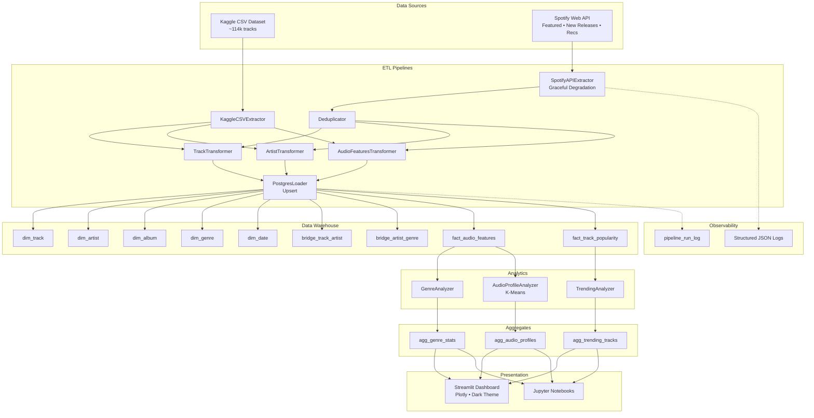

# Architecture

## System Overview



## Pipeline Architecture

### ETL Pattern

All pipelines follow the **Extract → Transform → Load** pattern using abstract base classes:

```
BasePipeline
├── KaggleLoadPipeline    (CSV → DW, run once)
├── IngestionPipeline     (API → DW, scheduled)
└── AnalyticsPipeline     (DW → aggregates)
```

Each pipeline uses `execute()` which wraps `run()` with lifecycle hooks:
- `_setup()` → `run()` → `_teardown()`
- On failure: `_on_failure()` is called
- Every run writes to `pipeline_run_log` for observability

### Star Schema Design

The data warehouse uses a **star schema** optimized for analytics queries:

- **Dimensions**: Track, Artist, Album, Genre, Date
- **Bridge tables**: Track↔Artist (many-to-many), Artist↔Genre (many-to-many)
- **Facts**: Audio Features (slowly changing), Track Popularity (append-only time series)
- **Aggregates**: Trending, Genre Stats, Audio Profiles (rebuilt by AnalyticsPipeline)

### Scheduling

APScheduler runs ingestion + analytics on a configurable interval (default: every 6 hours).

### Graceful Degradation

The `SpotifyAPIExtractor` tries each API endpoint independently. If one returns 403 or fails, it logs a warning and continues with the remaining endpoints.
